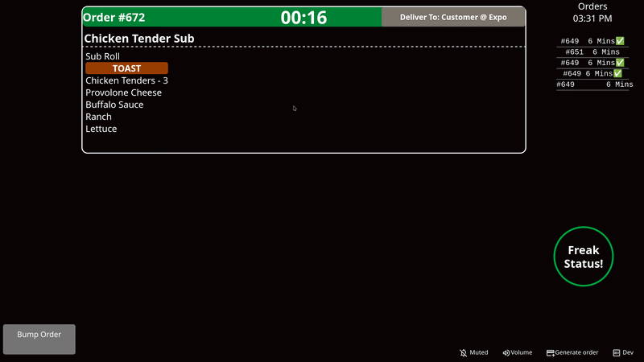

# Sheetz KDS / KPS Concept

A modern web-based Kitchen Display System created to improve communication, visibility, and workflow in high-speed kitchen environments.

This project was built as a proof of concept to present new ideas and inspire improvement within Sheetz operations.

## Why I Built This

The current system gets the job done and that fine.

But at Sheetz, the standard has always been more than “good enough.” Fast-paced environments rely on clear communication, quick decisions, and teamwork. When the kitchen runs smoother, everyone benefits:

- Team members on station  
- Managers making decisions  
- Coworkers taking over shifts  
- Most importantly, the customer  

I wanted to explore what a cleaner, smarter, more modern system could look like.

## Core Goals

- Understand order content and steps at a glance
- Reduce cognitive load  
- Improve visibility  
- Improve visual communication  
- Keep training simple for new employees
- Support speed without creating confusion  

## What a KDS Really Is

At its core, a Kitchen Display System is simple:

- A list of tasks  
- A status system (new / in progress / done)  
- A timer  

This project focuses on making those basics feel better to use.

## Features / Concepts

- Cleaner modern UI  
- Color-coded urgency / order states  
- Improved station organization  
- Ingredient + instruction visibility  
- Designed for speed and clarity  
- Expandable foundation for future backend systems  

## Built With
  
- Tailwind CSS  
- JavaScript  
- GitHub  
- Figma  
- VS Code  

## Project Status

Currently in active concept / prototype development.

This project is being iterated in phases, starting with frontend design, station workflows, and JSON-based mock order data.

## Final Note

This project is not about replacing people or overcomplicating work.

It is about improving an already solid system.
